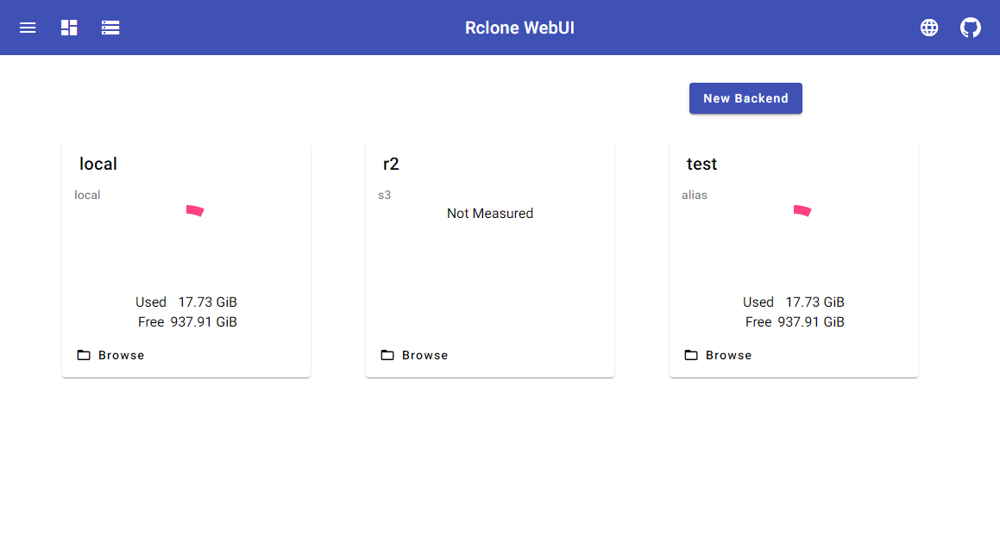
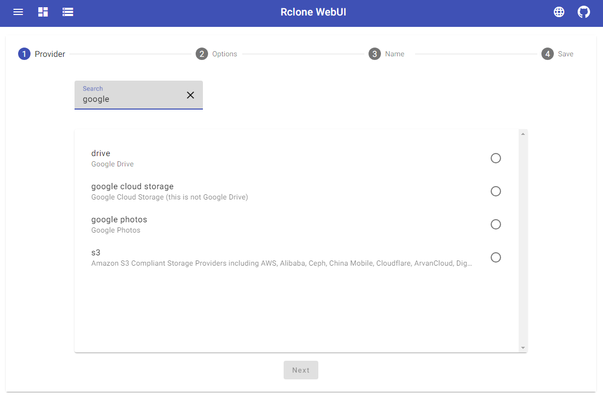
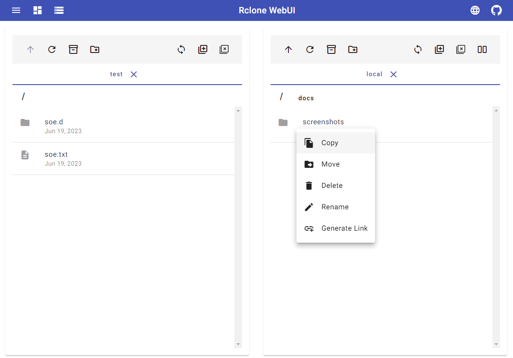
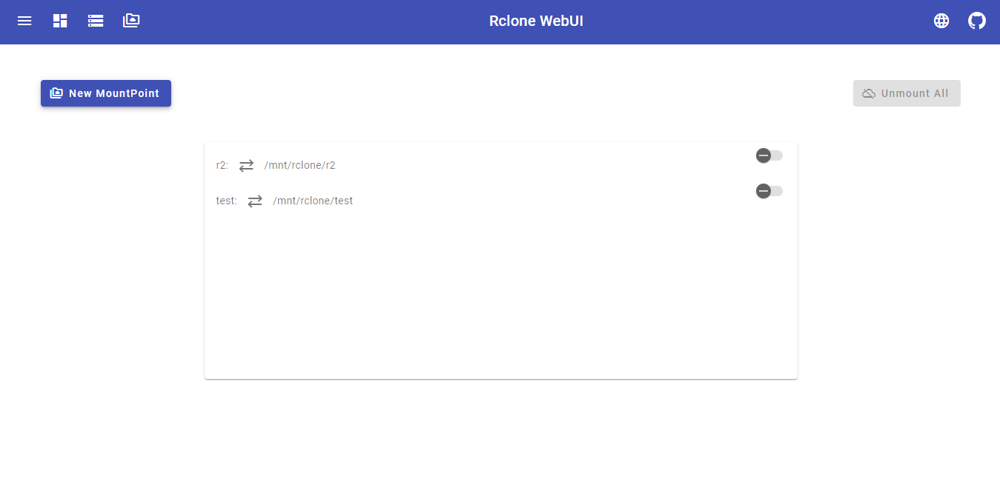

# Rclone-Webui-Angular

This project is another webui for [rclone](https://github.com/rclone/rclone)

WARNING: this project is still in development, please do not use it in production environment

## How to Use

Choose one that suits you

- [Desktop](./docs/native.md): Good for those who are not familiar with command line
- [Embed](./docs/embed.md): Good for managing local instance
- [PWA Standalone](./docs/pwa.md): Good for managing multiple remote servers

Other languages: [中文使用说明](./docs/zh/Instructions.md)

## Screenshot

    
Expend

backends

create backends

explorer

mounting

## Todo

- [x] Mounting management
- [x] Job viewer
- [x] International workflow
- [x] More Platforms
  - [x] Rclone embedded
  - [x] PWA Standalone
  - [x] Electron
- [ ] Scheduled task manager (Electron only)

## Contribute

If you feel like coding, translating or just want to help, please check [CONTRIBUTING.md](./docs/CONTRIBUTING.md)
